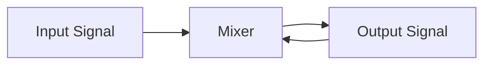

<style>
.note {
  background-color: rgb(114,74,6);
  color: white;
}
.picture {
display:block; 
margin-left: auto; 
margin-right: auto;
}
</style>
Computer Music Generator (CMG) User's Guide, Version 4.0
========================================================
<!-- TOC-->
- [Introduction](#introduction)
  - [What is Computer Music Generation?](#what-is-computer-music-generation)
  - [Key Concepts](#key-concepts)
- [Getting Started](#getting-started)
  - [Installation](#installation)
  - [First Launch](#first-launch)
  - [Creating Your First Composition](#creating-your-first-composition)
- [User Interface Overview](#user-interface-overview)
  - [Main Window](#main-window)
  - [Window Behavior](#window-behavior)
- [Working with Files](#working-with-files)
  - [File Types](#file-types)
  - [File Operations](#file-operations)
    - [New Composition](#new-composition)
    - [Open](#open)
    - [Save](#save)
    - [Save As](#save-as)
    - [Recent Files](#recent-files)
  - [File Locking](#file-locking)
- [Tracks](#tracks)
  - [Understanding Tracks](#understanding-tracks)
  - [Track Operations](#track-operations)
    - [Adding a Track](#adding-a-track)
    - [Renaming a Track](#renaming-a-track)
    - [Deleting a Track](#deleting-a-track)
    - [Move Track Up and Down](#move-track-up-and-down)
    - [Track Solo and Mute](#track-solo-and-mute)
    - [Track-Level Tools (<svg xmlns="http://www.w3.org/2000/svg" viewBox="0 0 24 24" fill="lime" width="1em" height="1em" style="vertical-align: middle;"><path d="M18 16H16V15H8V16H6V15H2V20H22V15H18V16M20 8H17V6C17 4.9 16.1 4 15 4H9C7.9 4 7 4.9 7 6V8H4C2.9 8 2 8.9 2 10V14H6V12H8V14H16V12H18V14H22V10C22 8.9 21.1 8 20 8M15 8H9V6H15V8Z" /></svg>)](#track-level-tools-)
      - [Track Volume](#track-volume)
      - [Track Shift](#track-shift)
      - [Track Duplicate](#track-duplicate)
- [Generators](#generators)
  - [Generator Types](#generator-types)
    - [Algorithmic Generators](#algorithmic-generators)
    - [Stochastic Generators](#stochastic-generators)
  - [Generator Operations](#generator-operations)
    - [Adding a Generator](#adding-a-generator)
    - [Editing a Generator](#editing-a-generator)
    - [Muting a Generator](#muting-a-generator)
    - [Moving/Copying a Generator](#movingcopying-a-generator)
    - [Deleting a Generator](#deleting-a-generator)
    - [Playing a Generator](#playing-a-generator)
    - [Reposition a Generator](#reposition-a-generator)
  - [Generator Dialog Features](#generator-dialog-features)
    - [Error Display](#error-display)
    - [Time Controls](#time-controls)
- [The Time Line](#the-time-line)
- [Time Interval](#time-interval)
  - [Define a Time Interval](#define-a-time-interval)
  - [Moving a Time Interval](#moving-a-time-interval)
  - [Resizing a Time Interval](#resizing-a-time-interval)
- [Playback, Recording, and Reporting](#playback-recording-and-reporting)
  - [Playing a Single Generator](#playing-a-single-generator)
  - [Playing Multiple Generators](#playing-multiple-generators)
  - [Playback](#playback)
    - [Play Dialog](#play-dialog)
  - [Recording](#recording)
    - [Audio Recording Formats](#audio-recording-formats)
    - [Audio Recording Settings](#audio-recording-settings)
    - [Video Recording](#video-recording)
  - [Reporting](#reporting)
- [Tools and Utilities](#tools-and-utilities)
- [Preferences](#preferences)
- [Comments](#comments)
- [Keyboard Shortcuts](#keyboard-shortcuts)
- [Tips and Best Practices](#tips-and-best-practices)
  - [Composition Workflow](#composition-workflow)
- [Generator Design](#generator-design)
  - [Algorithmic Generators](#algorithmic-generators-1)
  - [Stochastic Generators](#stochastic-generators-1)
- [Performance Optimization](#performance-optimization)
- [Troubleshooting Tips](#troubleshooting-tips)
- [Troubleshooting](#troubleshooting)
  - [Common Issues](#common-issues)
    - ["File is already open in another instance"](#file-is-already-open-in-another-instance)
    - ["Error Messages When Play is Selected"](#error-messages-when-play-is-selected)
    - ["Soundfont not found"](#soundfont-not-found)
    - [No Audio Output](#no-audio-output)
    - [Application Crashes](#application-crashes)
    - [Video Recording Fails](#video-recording-fails)
- [Getting Help](#getting-help)
- [Appendix A: CMG File Specification](#appendix-a-cmg-file-specification)
  - [CMG File Structure](#cmg-file-structure)
  - [Lock File Format](#lock-file-format)
- [Appendix B: Digital Signal Processing of Soundfont Presets](#appendix-b-digital-signal-processing-of-soundfont-presets)
  - [Soundfont File Structure](#soundfont-file-structure)
  - [Preset Generators](#preset-generators)
  - [Sound Generation Process](#sound-generation-process)
    - [Gain Envelope](#gain-envelope)
    - [Volume Modulation](#volume-modulation)
    - [Pitch Modulation](#pitch-modulation)
    - [Noise Application](#noise-application)
- [Appendix C: Algorithmic Generator Processing](#appendix-c-algorithmic-generator-processing)
  - [Beat and Note Processing](#beat-and-note-processing)
  - [Non-Sequencer Algorithmic Generation](#non-sequencer-algorithmic-generation)
  - [Sequencer Algorithmic Generation](#sequencer-algorithmic-generation)
  - [Attribute Modulation](#attribute-modulation)
    - [Constant Algorithm](#constant-algorithm)
    - [Sequencer Algorithm](#sequencer-algorithm)
    - [Oscillator Algorithm](#oscillator-algorithm)
    - [Markovian Algorithm](#markovian-algorithm)
    - [Autoregressive Algorithm](#autoregressive-algorithm)
    - [Wiener Algorithm](#wiener-algorithm)
    - [Poisson Algorithm](#poisson-algorithm)
- [Appendix D: Stochastic Generator Processing](#appendix-d-stochastic-generator-processing)
  - [Composition Processing](#composition-processing)
  - [Cloud Processing](#cloud-processing)
  - [Intensity Modulation](#intensity-modulation)
  - [Pan Modulation](#pan-modulation)
  - [Reverb Processing](#reverb-processing)
- [Appendix E: On Beats and Notes in Octave](#appendix-e-on-beats-and-notes-in-octave)
- [Appendix F: Glossary](#appendix-f-glossary)
- [Acknowledgements](#acknowledgements)
<!-- TOC-->
---

# Introduction

CMG (Computer Music Generator) is a desktop application developed using the Windows Platform Framework (WPF) for creating music through algorithmic and stochastic (chance-based) composition techniques. Whether you're an experimental composer, sound designer, or music educator, CMG provides powerful tools for generating, editing, and rendering complex musical structures.

CMG was inspired by the book [Formalized Music: Thought and Mathematics in Composition](https://en.wikipedia.org/wiki/Formalized_Music), by Iannis Xenakis, which I read many years ago and am just getting around to implementing something. Some of the features that Xenakis lays out are included along with other concepts of my own. 

The features of the CMG include:
- Retention of defined sound generation files between working sessions,
- The use of SoundFont files to produce sampled sounds,
- Pitch vibrato, intensity tremolo, and reverb effects,
- Pitch sequencing,
- The separation of sound generators into tracks that visually mimics the parts in a music score,
- Two types of sound generators: Algorithmic and Stochastic, and
- Previewing and recording of assembled compositions.

Below is an example composition in edit mode:
<p align="center">
  
  <br>
  <em>An example of a composition containing algorithmic and stochastic generators</em>
</p>

and the same composition in play mode:

<p align="center">
  
  <br>
  <em>An example of playing a generated composition</em>
</p>

## What is Computer Music Generation?

Computer music generation uses mathematical algorithms and probability models to create musical sequences. This approach enables:
- Exploration of musical patterns that would be difficult to perform manually
- Creation of long-form compositions with evolving structures
- Generation of variation and unpredictability in musical performance
- Integration of precise timing and control with creative randomness

## Key Concepts

- **Track**: A container for organizing related generators
- **Generator**: A musical pattern creator (either algorithmic or stochastic)
- **Timeline**: Visual representation of generators across time
- **Soundfont**: A collection of sampled instrument sounds (SF2 format)
- **Algorithm**: A mathematical formula that produces musical attribute values
- **Cloud**: In stochastic generators, a probabilistic distribution of notes

---

# Getting Started

## Installation

1. Download and install the latest version of [CMG](https://github.com/Blane245/CMGWpf.git)
2. Ensure you have .NET 10.0 Runtime installed
3. Launch `Computer Music Generator` from the Start Menu or desktop shortcut
4. Acquire some soundfont files from one of the many places on the internet. I suggest [PolyPhone](https://www.polyphone.io/en/soundfonts). Place them in the default location C:\Soundfonts. 

## First Launch

On first launch, CMG will:
- Display a splash screen with the CMG logo
- Start with an empty composition
- Position the window on your primary or secondary monitor
- Load existing lists of soundfont files, ensembles, and note sequences from the CMG Database. Initially, the database will be empty, but you can add to it using the DB Editor tool.

## Creating Your First Composition

1. **Create a Track**
   - Go to `Edit → Add Track`. The track will be named T0.

2. **Add a Generator**
           - Click the (<svg xmlns="http://www.w3.org/2000/svg" viewBox="0 0 24 24" fill="lime" width="1em" height="1em" style="vertical-align: middle;"><path d="M14 3V13.56C13.41 13.21 12.73 13 12 13C9.79 13 8 14.79 8 17S9.79 21 12 21 16 19.21 16 17V3H14Z" /></svg>) icon on the track control menu
   - Select either `Algorithmic` or `Stochastic` generator type. Try Algorithmic first as it is simpler and you CMG Database has no ensembles yet.

3. **Configure the Generator**
   - Set the start and stop times.
   - Configure musical parameters for the generator type. For an Algorithmic generator at a minimum, select the soundfont file and preset. Using defaults for all other parameters is fine for a first shot.
   - Click `OK` to save the generator. The generator will appear on the track with a name of G0.

4. **Preview Your Work**
   - Click `Play->Play` from the edit menu. The audio will be created from your generator.
   - When the Play window appears press <svg xmlns="http://www.w3.org/2000/svg" viewBox="0 0 24 24" fill="lime" width="1em" height="1em" style="vertical-align: middle;"><path d="M8,5.14V19.14L19,12.14L8,5.14Z" /></svg> to listen to the generated audio. The default algorithmic generator plays a C4 (middle C) at 60 beats per minute (BPM).

5. **Save Your Composition**
   - Go to `File → Save As...`
   - Choose a location and filename (.cmg extension). Your file will be included in the Recent Files list for easy access later.

---
# User Interface Overview

## Main Window

The main window consists of:

**Title Bar**
- CMG logo (left)
- Menu (left-center)
- Composition filename (center)
- Window controls: Minimize, Maximize, Close (right)

**Menu**
- File: New, Open, Save, Save As, Recent files, Exit
- Edit: Add Track, Preferences, Comments
- Tools: Utilities for database maintenance, and generator manipulation and calculations
- Play: Playback and reporting functions
- Help: About CMG and User's Guide link

**Timeline**
- Zoom and pan controls
- Horizontal timeline showing time progression. The position and scale depending on the pan and zoom settings.

**Body**
- Vertical track lanes
- Generator blocks showing their temporal extent

**Status/Message Area**
- Displays informational messages, warnings, and errors
- Automatically scrolls to show recent messages
- Cleared when starting a new operation

## Window Behavior
CMG supports modern window management:
- **Multiple Instances**: Run multiple CMG instances simultaneously (different files only)
- **Non-Modal Dialogs**: Edit multiple tracks and generators, and bringing up multiple tools concurrently
- **Window Memory**: Remembers size and position across sessions
- **Taskbar-Aware Maximize**: Maximizes without overlapping the taskbar
---
# Working with Files
## File Types
**CMG File (.cmg)**
- Native CMG composition format
- XML-based structure
- Contains timeline, and all tracks and generators for a composition
## File Operations
### New Composition
`File → New` or `Ctrl+N`
- Prompts to save current file if modified
- Creates empty composition with default settings
### Open
`File → Open` or `Ctrl+O`
- Opens file browser to select .cmg file
- Cannot open files already opened in another CMG instance
- Displays error if file is locked
### Save
`File → Save` or `Ctrl+S`
- Saves current composition to existing filename
### Save As
`File → Save As` or `Ctrl+Shift+S`
- Saves composition with new filename
- Useful for creating variations
### Recent Files
`File → Recent`
- Shows recently opened files
- Click to open (subject to file locking)
- Also available from Windows taskbar Jump List
## File Locking
CMG prevents multiple instances from opening the same file:
- Lock files (`.lock`) created when opening a composition
- Automatically cleaned up on normal exit
- Stale locks (older than 1 hour) are automatically removed
- Manual unlock may be required if application crashes
---

# Tracks

## Understanding Tracks

Tracks organize your composition into logical layers, similar to tracks in a DAW (Digital Audio Workstation). Each track must have a unique name and can contain multiple generators that play sequentially or simultaneously.

## Track Operations

### Adding a Track
`Edit → Add Track` or `Ctrl+T`
1. Track appears in the body of the window below existing tracks 
3. Given a unique name starting the "T".

### Renaming a Track
`Track → Rename Track` (<svg xmlns="http://www.w3.org/2000/svg" viewBox="0 0 24 24" fill="lime" width="1em" height="1em" style="vertical-align: middle;"><path d="M15 16L11 20H21V16H15M12.06 7.19L3 16.25V20H6.75L15.81 10.94L12.06 7.19M18.71 8.04C19.1 7.65 19.1 7 18.71 6.63L16.37 4.29C16.17 4.09 15.92 4 15.66 4C15.41 4 15.15 4.1 14.96 4.29L13.13 6.12L16.88 9.87L18.71 8.04Z" /></svg>)
1. Enter new unique name
1. The track will be renamed with the new name

### Deleting a Track
`Track → Delete Track` (<svg xmlns="http://www.w3.org/2000/svg" viewBox="0 0 24 24" fill="lime" width="1em" height="1em" style="vertical-align: middle;"><path d="M19,4H15.5L14.5,3H9.5L8.5,4H5V6H19M6,19A2,2 0 0,0 8,21H16A2,2 0 0,0 18,19V7H6V19Z" /></svg>)
1. Confirm deletion
4. The track and all of its generators are removed

### Move Track Up and Down
Tracks can be moved up and down in the vertical display of tracks. Use `Track->Move Up` (<svg xmlns="http://www.w3.org/2000/svg" viewBox="0 0 24 24" fill="lime" width="1em" height="1em" style="vertical-align: middle;"><path d="M13,20H11V8L5.5,13.5L4.08,12.08L12,4.16L19.92,12.08L18.5,13.5L13,8V20Z" /></svg>) and `Track->Move Down` (<svg xmlns="http://www.w3.org/2000/svg" viewBox="0 0 24 24" fill="lime" width="1em" height="1em" style="vertical-align: middle;"><path d="M11,4H13V16L18.5,10.5L19.92,11.92L12,19.84L4.08,11.92L5.5,10.5L11,16V4Z" /></svg>) to performs these operations.
### Track Solo and Mute
When playing a composition, tracks can be muted or soloed. None of the generators in a muted track will be heard. One or more tracks can be soloed, in which case all other tracks will not be heard. Use `Track->Mute` (<svg xmlns="http://www.w3.org/2000/svg" viewBox="0 0 24 24" fill="lime" width="1em" height="1em" style="vertical-align: middle;"><path d="M14,3.23V5.29C16.89,6.15 19,8.83 19,12C19,15.17 16.89,17.84 14,18.7V20.77C18,19.86 21,16.28 21,12C21,7.72 18,4.14 14,3.23M16.5,12C16.5,10.23 15.5,8.71 14,7.97V16C15.5,15.29 16.5,13.76 16.5,12M3,9V15H7L12,20V4L7,9H3Z" /></svg>) and `Track->Solo` (<svg xmlns="http://www.w3.org/2000/svg" viewBox="0 0 24 24" fill="lime" width="1em" height="1em" style="vertical-align: middle;"><path d="M12,4A4,4 0 0,1 16,8A4,4 0 0,1 12,12A4,4 0 0,1 8,8A4,4 0 0,1 12,4M12,14C16.42,14 20,15.79 20,18V20H4V18C4,15.79 7.58,14 12,14Z" /></svg>) for these operations. The buttons will change to (<svg xmlns="http://www.w3.org/2000/svg" viewBox="0 0 24 24" fill="lime" width="1em" height="1em" style="vertical-align: middle;"><path d="M12,4L9.91,6.09L12,8.18M4.27,3L3,4.27L7.73,9H3V15H7L12,20V13.27L16.25,17.53C15.58,18.04 14.83,18.46 14,18.7V20.77C15.38,20.45 16.63,19.82 17.68,18.96L19.73,21L21,19.73L12,10.73M19,12C19,12.94 18.8,13.82 18.46,14.64L19.97,16.15C20.62,14.91 21,13.5 21,12C21,7.72 18,4.14 14,3.23V5.29C16.89,6.15 19,8.83 19,12M16.5,12C16.5,10.23 15.5,8.71 14,7.97V10.18L16.45,12.63C16.5,12.43 16.5,12.21 16.5,12Z" /></svg>) and (<svg xmlns="http://www.w3.org/2000/svg" viewBox="0 0 24 24" fill="lime" width="1em" height="1em" style="vertical-align: middle;"><path d="M21.1,12.5L22.5,13.91L15.97,20.5L12.5,17L13.9,15.59L15.97,17.67L21.1,12.5M10,17L13,20H3V18C3,15.79 6.58,14 11,14L12.89,14.11L10,17M11,4A4,4 0 0,1 15,8A4,4 0 0,1 11,12A4,4 0 0,1 7,8A4,4 0 0,1 11,4Z" /></svg>), respectively. If a track is both soloed and muted, mute takes precedence and the track will not be heard.
### Track-Level Tools (<svg xmlns="http://www.w3.org/2000/svg" viewBox="0 0 24 24" fill="lime" width="1em" height="1em" style="vertical-align: middle;"><path d="M18 16H16V15H8V16H6V15H2V20H22V15H18V16M20 8H17V6C17 4.9 16.1 4 15 4H9C7.9 4 7 4.9 7 6V8H4C2.9 8 2 8.9 2 10V14H6V12H8V14H16V12H18V14H22V10C22 8.9 21.1 8 20 8M15 8H9V6H15V8Z" /></svg>)

#### Track Volume
`Track → Tools → Volume`
- Adjusts overall volume for all generators on track
- Range: -100 dB to +100 dB (0 dB = no change)
- Applied during playback

#### Track Shift
`Track → Tools → Shift`
- Moves all generators on track forward or backward in time. The shift must not move any generator such that its start time is less than zero.
- Useful for adjusting timing relationships between tracks
<div class="note">**Note**: This operation cannot be performed when any generators on the track are being edited.</div>

#### Track Duplicate
`Track → Tools → Duplicate`
- Creates a new copy of the track with a new name and all generators with new names. Places the new track at the end of all of the tracks.
- Useful to set a starting point for a set of generators that are similar to those on an existing track.
<div class="note">**Note**: This operation cannot be performed when any generators on the track are being edited.</div>

---

# Generators

Generators are the core of CMG, defining the actual musical content. There are two types: **Algorithmic** and **Stochastic**. The details of the parameter setting and the algorithms employed by the generators can be found in the appendices.

<p class="note">In what follows, a number of the algorithms include a random number generator, and an optional seed can be provided for each individually. If a seed is not specified, the date and time value when the composition is built is used to seed the random number generator. This causes different sequence of values to be created each time the composition is built. A seed can be manually entered or one can be generated. Seeds for each random generator may be different or the same as desired.</p>

## Generator Types

### Algorithmic Generators

Algorithmic generators use mathematical formulas to create deterministic or probabilistic musical sequences. These generators control the values of musical attributes by using algorithms. The musical attributes are:

- **Note (pitch) Algorithm**: Determines which notes to play
- **Speed (tempo) Algorithm**: Controls tempo/rhythm
- **Duration (note value) Algorithm**: Sets note lengths
- **Attack (velocity) Algorithm**: Controls note velocity 
- **Volume (intensity) Algorithm**: Overall level adjustment
- **Pan (channel) Algorithm**: Stereo positioning

**Algorithm Types:**
Each of the attributes has a algorithm assigned to it. More details may be found in [Appendix C: Algorithmic Generator Processing](#appendix-c-algorithmic-generator-processing). The algorithms are:
- **Constant**: Value is always the same
- **Oscillator**: Value cycles over time with a given frequency and amplitude
- **Markovian**: Value remains the same, goes up, or goes down within a certain range at a given step size, with specified probabilities
- **Wiener**: Value does a random walk with a specified trend and deviation
- **Autoregressive**: Value does a random walk with a specified memory of the previous value.
- **Poisson**: Value is taken at random from a set of possible values within a range.
- **Sequencer**: Sequence of values obtained from the CMG Database. Sequences can be transposed, inverted, or reflected. <b><i>The Sequencer apply only to the note attribute</i></b>.
<p class="note">Note: as CMG converts the generator definitions into sound, it will constrain the attribute values within the valid limits of that parameter. For example, if an pan algorithm generates a value outside of [-1,+1] the value will be constained to remain within those limits. The Markovian algorithm has an addition feature. The value will "bounce" off of the limit, turning the opposite direction.</p>

**General Parameters:**
- **SoundFont**: Name of the soundfont file to get sound samples
- **Preset**: Name of the preset of the specific sound samples desired
- **Looping?**: Enable instrument defined looping
- **Attack?**: Enable the attack phase of the intensity envelope as defined in the Soundfont instrument
- **Microtones**: Enable pitch values between semitones
- **Noise:** Frequency modulated Gaussian noise may be applied to the signal
    - **Seed**: The seed of the random number generator. Click `New Seed` to have one generated.
    - **Level (+-10dB)**: The amount of random noise
    - **Frequency (Hz)**: The frequency of the noise
- **Reverb**: 
    - **Delay (msec)**: The time delay of the original signal feeding into the reverberator
    - **Decay (1-10dB)**: The amount of signal decay applied to the reverberator
- **Tremolo**: The cyclic change in volume of the signal 
    - **Speed (mHz)**: The cycle speed of the tremolo
    - **Depth (dB)**: The amount of intensity variation
    - **Modulator** One of the available oscillators
- **Vibrato**: The cyclic change in pitch of the signal 
    - **Speed (mHz)**: The cycle speed of the vibrato
    - **Depth (cents)**: The amount of pitch variation
    - **Modulator**: One of the available oscillators
- **Measure**: The pattern of on and off beats within a measure
     - **Length (beats)**: The number of beats in a measure
     - **On Beats (beats)**: How many beats will be heard in the measure (between 1 and the measure length)
     - **Beat Shift**: The number of beats to shift the on beat pattern (between 0 and measure length - 1)
- **Octave**:
    - **Note Count (1-12)**: The number of on tones in an octave
    - **Shift (tones)**: The shift in the on tone pattern (between 0 and 11)

### Stochastic Generators

Stochastic generators create music through probability distributions called "clouds." A "composition" is constructed based on a time grid and an "ensemble" of voices. Based on this composition, "clouds" are constructed for each time cell and voice.

**Structure:**
- **Ensemble**: A collection of voices
- **Voices**: Individual Soundfont Presets with independent settings
- **Composition**: Grid of voices events across time cells
- **Cloud**: Probabilistic event distributions within time cells
- **Event**: An individual note event within a cloud

**Composition Parameters**: 

These only affect the definition of the composition. Any changes to them will delete an existing composition.

- **Ensemble**: The name of an ensemble from the CMG Database
- **Composition Length (sec)**: Duration of the composition
- **Number of Time Cells**: Number of equally-spaced time divisions. Each cell will be the composition length divided by the number of cells.
- **Clouds/Cell**: Average number of clouds within a given time division
- **Composition Seed**: Seed of the random number generators for the composition
  
Once a composition is defined it can be built with the `Build Composition` button. The composition matrix will be displayed with its non-muted voices as columns and the time cells as rows. The rows and columns can be moved around to place the events into desired voices or time cells. 

**Dynamics Parameters**: 

These affect the production of sound from the defined composition. Changes to these parameters do not affect a built composition.

- **Sounds/Second**: Average number of sound events in a cloud
- **Microtones?**: Enables the use of microtones between semi-tones
- **Intensity Transition**: Variation of the volume over time
    - **Scope Option**: Where intensity transition are applied. Either Cloud, Voice, or Composition level
    - **Transition Option**: Performed either by persisting the last intensity level to the next transition or randomly selecting an new transition profile
    - **Cycle Time**: Average period of time that intensity transitions occur
- **Pan**: How the sound moves between channels
    - **Scope Option**: Where pan are applied. Either Cloud, Voice, or Composition level
    - **Method**: Performed either by gliding to the next pan value or making random changes each cycle.
    - **Cycle Time**: Average period of time between pan changes
- **Reverb**: How reverb is applied to the sound
    - **Delay (msec)**: The time delay of the original signal feeding into the reverberator
    - **Decay (1-10dB)**: The amount of signal decay applied to the reverberator

**Ensemble Definition**

An ensemble is a collection of voices. Ensembles and Voices are stored in the CMG Database. The database has the following parameters defined for each voice.
- **Name**: Name of the voice
- **Description**: Optional voice description 
- **Timber**: Either sustained for glissando
- **Register Lo and Hi**: The lowest and highest notes that can be played by the voice
- **Duration**: For sustained voices, the percentage of time interval that the voice plays. Zero means 100%. Lower percentages cause a pizzicato effect.
- **Sondfont**: Name of the soundfont file
- **Preset**: Bank, channel, and name of the voices preset.

The following parameters may be set for each voice:
- **Volume**: Relative volume (+-100dB) of the voice
- **Velocity**: Velocity, or attack, value of the voice [0-127]
- **Mute**: Disable the voice in the final composition. 

Ensembles and voices may be changed within the CMG Database independent of their use within CMG. Each time a CMG file is loaded, the ensemble and voices are reread from the database. If changes are made while a file is opened, this changes will only take effect by pressing the **Reload** buttons `Ensemble` or `Voices`. 

## Generator Operations

### Adding a Generator
1. Track->Add generator (<svg xmlns="http://www.w3.org/2000/svg" viewBox="0 0 24 24" fill="lime" width="1em" height="1em" style="vertical-align: middle;"><path d="M14 3V13.56C13.41 13.21 12.73 13 12 13C9.79 13 8 14.79 8 17S9.79 21 12 21 16 19.21 16 17V3H14Z" /></svg>)
2. Choose Algorithmic or Stochastic
3. Generator editor opens in Add mode
4. Configure parameters
5. Click `OK` to add generator or `Cancel` to discard
5. Generator cannot be added until all parameters have been entered correctly

### Editing a Generator
1. Right click the generator
1. Select `Edit...`
2. Generator editor opens
3. Modify parameters
4. Click `OK` to save changes or `Cancel` to discard
5. Generator cannot be modified until all parameters have been entered correctly
5. Multiple generators can be edited simultaneously

### Muting a Generator
1. Right click the generator
1. Select `Mute`
1. The generator will be muted and the menu item will change to `Unmute`
1. Selecting `Unmute` will unmute the generator

### Moving/Copying a Generator
1. Right-click generator
2. Select `Move to Track...` or `Copy to Track...`
3. Choose destination track
4. Generator is moved/copied
5. Cannot move/copy if the generator is being edited

### Deleting a Generator
1. Right-click generator
2. Select `Delete...`
3. Confirm deletion
4. Cannot delete if generator is being edited

### Playing a Generator
1. Click `Play...` button in generator editor or from the generator menu
1. Plays the current generator
1. Useful for reviewing changes before saving or playing with other generators
### Reposition a Generator
The generator box is 1/3 of the height of a track. This provides space so that generators that are simultaneous or overlapping in time on the same track can be de-conflicted. To move a generator up and down within the track boundaries:
1. Left click the generator and a resize north-south cursor will be display
1. Drag the mouse either up or down and the generator box will follow within the bounds of the track. 
1. Release the mouse button and the reposition is complete. 

## Generator Dialog Features

### Error Display
All generator parameters must be correct. Numbers must be in valid ranges. The bottom of the generator dialog shows validation errors in a scrolling list. If errors exist the generator cannot be modified or played.

### Time Controls
All generators must have a non-negative start and stop time. The stop time must be greater than the start time.
- **Start Time**: When generator begins in seconds
- **Stop Time**: When generator ends in seconds
- **Auto-adjust**: Changing start time maintains duration by changing the stop time

---

# The Time Line
The time line is the horizontal bar above the tracks that shows the progression of time. The time line can be zoomed (<svg xmlns="http://www.w3.org/2000/svg" viewBox="0 0 24 24" fill="lime" width="1em" height="1em" style="vertical-align: middle;"><path d="M19,13H13V19H11V13H5V11H11V5H13V11H19V13Z" /></svg>) (<svg xmlns="http://www.w3.org/2000/svg" viewBox="0 0 24 24" fill="lime" width="1em" height="1em" style="vertical-align: middle;"><path d="M19,13H5V11H19V13Z" /></svg>) and panned (<svg xmlns="http://www.w3.org/2000/svg" viewBox="0 0 24 24" fill="lime" width="1em" height="1em" style="vertical-align: middle;"><path d="M20,11V13H8L13.5,18.5L12.08,19.92L4.16,12L12.08,4.08L13.5,5.5L8,11H20Z" /></svg>) (<svg xmlns="http://www.w3.org/2000/svg" viewBox="0 0 24 24" fill="lime" width="1em" height="1em" style="vertical-align: middle;"><path d="M4,11V13H16L10.5,18.5L11.92,19.92L19.84,12L11.92,4.08L10.5,5.5L16,11H4Z" /></svg>) to view different time ranges. The time line also serves as the area for defining time intervals for playback and reporting.
# Time Interval

A time interval can be defined to select a subset of generators for playback and reporting. All generators whose start and stop times are within the time interval are considered selected, and their boxes will become slightly darker to indicate they are selected. 
## Define a Time Interval
1. Move the cursor within the time line. The cross cursor will be displayed. 
1. Left click and drag the mouse left or right. The time interval box will be displayed in the time line. Generators selected will highlight as they become enclosed in the interval.
1. Release the left button and the time interval definition is complete.
1. One click of the left button outside of an exiting time interval will delete the interval.
## Moving a Time Interval
1. Move the mouse into the time interval. The cursor will change to a scroll-west-east cursor.
1. Left click and drag the mouse left and right. The time interval box will reposition as the mouse is moved and the selected generators will be highlighted.
1. Release the left button and the time interval redefinition is complete.
## Resizing a Time Interval
1. Move the cursor near the right or left edge of the time interval. The cursor will change to a resize west-east cursor.
1. Left click and drag the mouse left or right. The time interval box change as the mouse is moved. Generators selected will highlight as they become enclosed in the interval.
1. Release the left button and the time interval definition is complete.

---

# Playback, Recording, and Reporting
The purpose of CMG is to create sound based from defined generators. This is the heart of the application. Playback has several ways that it can be invoked.

## Playing a Single Generator
By either selecting the `Play...` option on the generator menu or by pressing the `Play` button in the generator edit dialog, that generator, and only that one, will be played. A generator that is being edited must be valid before it can be played. These methods are useful will constructing a generator to hear what it sounds like on its own.

## Playing Multiple Generators
If a time interval has been defined and either the `Play->Play...` or `Play->Report...` option is selected from the Play menu, only the generators that are within the time interval will be used for the playback or reporting. This overrides track mute and solo, and generator mute settings.

If no time interval is defined, all generators in solo tracks will be selected if they are not muted. If no tracks are soloed, then all generators in non-muted tracks that are not muted themselves are selected.

## Playback

### Play Dialog
`Play → Play...`, `CTRL+SHIFT+P`, generator menu item `Play...` , or `Play` in generator editor will cause the creation of an audio signal and the sound roll. Once this is complete the Play Dialog is displayed. This blocks access to the main file edit window until the dialog is closed. As the audio is being played or repositioned, the scroll roll will be moved to synchronize with the change. 

The Play dialog provides:
- **Restart**: Clicking (<svg xmlns="http://www.w3.org/2000/svg" viewBox="0 0 24 24" fill="lime" width="1em" height="1em" style="vertical-align: middle;"><path d="M12,4C14.1,4 16.1,4.8 17.6,6.3C20.7,9.4 20.7,14.5 17.6,17.6C15.8,19.5 13.3,20.2 10.9,19.9L11.4,17.9C13.1,18.1 14.9,17.5 16.2,16.2C18.5,13.9 18.5,10.1 16.2,7.7C15.1,6.6 13.5,6 12,6V10.6L7,5.6L12,0.6V4M6.3,17.6C3.7,15 3.3,11 5.1,7.9L6.6,9.4C5.5,11.6 5.9,14.4 7.8,16.2C8.3,16.7 8.9,17.1 9.6,17.4L9,19.4C8,19 7.1,18.4 6.3,17.6Z" /></svg>) will restart the playback
- **Pause/Resume**: Clicking (<svg xmlns="http://www.w3.org/2000/svg" viewBox="0 0 24 24" fill="lime" width="1em" height="1em" style="vertical-align: middle;"><path d="M14,19H18V5H14M6,19H10V5H6V19Z" /></svg>) will continue playback from the current position, while clicking (<svg xmlns="http://www.w3.org/2000/svg" viewBox="0 0 24 24" fill="lime" width="1em" height="1em" style="vertical-align: middle;"><path d="M8,5.14V19.14L19,12.14L8,5.14Z" /></svg>) will pause the playback
- **Volume Control**: Manual control of the volume of the playback
- **Progress Bar**: Visual playback position with manual control
- **Time Display**: Current time and total duration
- **Voice Legend**: Clicking (<svg xmlns="http://www.w3.org/2000/svg" viewBox="0 0 24 24" fill="lime" width="1em" height="1em" style="vertical-align: middle;"><path d="M13 20.5C13 21.03 13.09 21.53 13.26 22H6C4.89 22 4 21.11 4 20V4C4 2.9 4.89 2 6 2H7V9L9.5 7.5L12 9V2H18C19.1 2 20 2.89 20 4V11H16.5V16.11C14.5 16.57 13 18.36 13 20.5M20 13H18.5V18.21C18.19 18.07 17.86 18 17.5 18C16.12 18 15 19.12 15 20.5S16.12 23 17.5 23 20 21.88 20 20.5V15H22V13H20Z" /></svg>) displays or hides the table of voices with their soundfont, preset, and color.
- **Signal Levels**: Visual feedback of the average and maximum signal levels of the left and right channels
- **Record Audio**: Clicking (<svg xmlns="http://www.w3.org/2000/svg" viewBox="0 0 24 24" fill="lime" width="1em" height="1em" style="vertical-align: middle;"><path d="M17.3,11C17.3,14 14.76,16.1 12,16.1C9.24,16.1 6.7,14 6.7,11H5C5,14.41 7.72,17.23 11,17.72V21H13V17.72C16.28,17.23 19,14.41 19,11M10.8,4.9C10.8,4.24 11.34,3.7 12,3.7C12.66,3.7 13.2,4.24 13.2,4.9L13.19,11.1C13.19,11.76 12.66,12.3 12,12.3C11.34,12.3 10.8,11.76 10.8,11.1M12,14A3,3 0 0,0 15,11V5A3,3 0 0,0 12,2A3,3 0 0,0 9,5V11A3,3 0 0,0 12,14Z" /></svg>) will start audio recording. 
- **Record Video**: Clicking (<svg xmlns="http://www.w3.org/2000/svg" viewBox="0 0 24 24" fill="lime" width="1em" height="1em" style="vertical-align: middle;"><path d="M15,8V16H5V8H15M16,6H4A1,1 0 0,0 3,7V17A1,1 0 0,0 4,18H16A1,1 0 0,0 17,17V13.5L21,17.5V6.5L17,10.5V7A1,1 0 0,0 16,6Z" /></svg>) will start video recording. 
- **Exit**: Closing the window will terminate playback
- **Minimize/Maximize**: Window controls
- **Sound Roll**: The scroll roll is a visual representation of the composition with time on the horizontal axis and tone on the vertical axis. Up to 1 minute of the composition is displayed at a time. The tonal scale extends from C-1 to C9. As an instrument plays, its sound is represented by a line drawn from the start of the sound until its end. The color of the line depends on its generator and voice in the case of a stochastic generator. Glissandi voices are represented by lines that begin at the start tone and end at the end tone. As the composition is played or repositioned, the scroll roll moves such that the current time is to the left of the display, marked by a vertical red line.

<p class="note">**Important**: While the play dialog is active, main window is blocked. Minimize the play window if you need to access other applications.</p>

## Recording
Before recording starts a file dialog request where the recording is to be placed. Progress bars with a cancel option are available during audio and video recording. The default file name is the CMG file name with the appropriate file type (.wav, .mp3, or .mp4).
### Audio Recording Formats
Recording format can be changed in `Edit->Preferences`. There are two available
- **wav**: Uncompressed, high quality
- **mp3**: Compressed, smaller file size
### Audio Recording Settings
- Sample Rate: 44.1 kHz
- Bit Depth: 16-bit (WAV), Variable (MP3)
- Channels: Stereo
### Video Recording
Creates MP4 video of the composition's audio with the scroll roll animated:
- Synchronized audio track
- Animated sound roll visualization
- 30 frames per second

## Reporting

`Play → Report`

Creates detailed HTML report with:
- Composition metadata
- Track listings
- Generator parameters
- Generated signal processing data for each instrument (source)

**Uses**: Documentation, debugging, sharing composition details

---

# Tools and Utilities
CMG tools are accessible from the Tools menu. They include some convenient calculators, access to the CMG Database Editor, and generator timing manipulators.
<p class="note">**Note**: As many calculator tools can be opened simutaneously as desired. Generator tools cannot be used if any generator is being edited.</p>

- **Ensemble Voice Editor**: Provides maintenance of stochastic generator ensembles and voices
- **Note Sequence Editor**: Provides maintenance of algorithmic note sequences
- **Generator and Calculator Tools**:
    - **Midi/Frequency Converter**: Used to convert a midi number to its audio frequency (Hz) and vice versa
    - **Measure Duration Calculator**: Takes the number of beats in a measure and a speed (BPM) and calculates the number of seconds in the measure
    - **Oscillator Frequency Calculator**: Takes an midi amplitude and speed (BPM) and calculates the modulator frequency (mHz) that will cause all notes in the amplitude to be played. 
    - **Set Generators Duration Equal**: Sets the duration of a list of secondary generators equal to a primary one while maintaining either the start or stop time
    - **Align Generators Start or Stop Times**: Sets the start or stop time of a list of secondary generators equal to a primary one while maintaining either the start or stop time
    - **Stagger Generators Start Time**: Stagger the start times of a list of secondary generators a specified number of seconds from the start time of a primary one. Staggers occurs in the order of the secondary in the list so the list can be reordered as necessary.

---

# Preferences
`Edit → Preferences` `Ctrl+P` will display the preferences dialog, which sets preferences that are maintained between CMG sessions. Be mindful that changing preferences in one instance of CMG will affect the preferences of the other instances.
- **Soundfont Directory**: The file system directory that contains the soundfont files. The default value is C:\Soundfonts
- **Record Format**: Audio recording format, either .mp3 or .wav

<p class="note">**Note**: The following preferences do not affect CMG as they are not currently implemented.</p>

- **Time Line Mode**: Either Time or Measure
- **Measure Length (sec)**: The duration of a measure
- **Beats per Measure**: The number of beats in a measure
- **Snap Mode**: Enable time line snap mode
- **Snap Increment**: The number of seconds or beats where snapping occurs

# Comments
`Edit → Comment` or `Ctrl+Shift+C` will provide a dialog that edits the comments of the CMG file. This is useful for project information, compositional intentions, and revision history among other things.

---

# Keyboard Shortcuts

| Action | Shortcut |
|--------|----------|
| New Composition | `Ctrl+N` |
| Open Composition | `Ctrl+O` |
| Save | `Ctrl+S` |
| Save As | `Ctrl+Shift+S` |
| Recent File | `Ctrl+n` n=0-9 |
| Add Track | `Ctrl+T` |
| Edit Comment | `Ctrl+Shift+C` |
| Edit Preferences | `Ctrl+P` |
| Ensemble Voice Editor | `Ctrl+E` |
| Note Sequence Editor | `Ctrl+D` |
| Generator and Calculator Tools | `Ctrl+G` |
| Play | `Ctrl+Shift+P` |
| Report | `Ctrl+Shift+R` |

---

# Tips and Best Practices

## Composition Workflow

1. **Plan Your Structure**
   - Sketch out tracks and their roles
   - Consider which parts are algorithmic vs. stochastic
   - Think about temporal relationships

2. **Start Simple**
   - Begin with one track and one generator
   - Test playback early and often
   - Add complexity gradually
   - Use the comment to note features of the composition

3. **Use Meaningful Names**
   - Name tracks and generators descriptively
   - Makes navigation easier in complex projects
   - Helps when returning to old projects

3. **Time Line Zoom and Pan**
   - Zoom and pan the time line as you work to focus on a certain area or to get a fuller overview
   - Use the time interval to listen to a certain period of time while constructing a large composition
   - The zoom and pan setting, and the time interval are saved with the CMG file so it will start where you left off

4. **Save Regularly**
   - Use `Ctrl+S` frequently
   - Create backup copies with `Save As` `Ctrl+Shift+S`
   - Consider version numbering (e.g., MyPiece_v1, MyPiece_v2)

# Generator Design
Here is some guidance for building generators. Generally it is best to used fixed random number seeds so that random effects are predictable during generator construction. Only use an empty seed if you want each rendition to be different. 
<p class="note">**Note**: If you are not using fixed random number seeds and like the rendition, remember to save the audi and/or video. You will never hear it again once you leave the Play dialog.</p>

Both generator types have the ability to make the note duration less than the interval it is played in. This enables staccato and removes long release times. For example, when playing a C4 at 60 BPM, the note interval is 1 second and the note will be fully released based on its preset modulator value for the release envelope. By adjusting the duration, the length of the note can be made to be less than 1 second and the release removed. 

## Algorithmic Generators
- **Test Algorithms Independently**: Use constant values for other parameters while testing one algorithm.
- **Use Euclidean Rhythms**: Great for creating poly-rhythms and interesting patterns
- **Combine Algorithm Types**: For example, use Markovian note selection with Autoregressive speed for variation. 
- **Experiment with microtones**: Using microtones can have interesting sound effects but may cause sonic "clutter".
- **Layer Generators**: Multiple simple generators can create complex results.

## Stochastic Generators
- **Start with Few Voices**: The voices in a large ensemble can be muted to 2-4 voices which is easier to manage and understand the relationships between the voices.
- **Use Fewer Time Cells**: Start with 2-4 cells, change composition length and add more as needed.
- **Control Density**: Too many events per cell or large sound density can muddy the texture.
- **Experiment with Intensity, Pan, and Reverb**: Find the parameters that produces the best sonic effects. 
- **Experiment with microtones**: Using microtones can have interesting sound effects but may cause sonic "clutter".
- **Adjust the Time Rows and Voice Columns**: Move the time rows up and down to aggregate or disperse silent and intense period. Move the voice columns left and right to change event densities for voices. 

# Performance Optimization

- **Soundfont Size**: Smaller soundfonts load faster
- **Generator Count**: Many generators increase CPU load. Rendering a composition is done using multi-threading to make the best use of computer SPU and memory resources. 
- **Close Unused Dialogs**: Non-modal dialogs consume memory

# Troubleshooting Tips

- **Generator Won't Play**: Check error messages on the main window or the generator dialog
- **File Won't Open**: Another instance may have it open; check for .lock file. The file may not be in proper CMG format.
- **No Sound**: Check system audio output device for proper functioning. Increase system volume. Increase playback volume. Increase track volume. Check generator volume.
- **Distorted Audio**: Could be a bad preset in the soundfont. Use another soundfont application to determine its parameters and quality. Reduce volume to prevent clipping. Excessive reverberation and instruments with long release times can cause distortion.
- **Slow Playback**: System is overloading memory or CPU usage. Check task manager for the use of these resources.

---

# Troubleshooting

## Common Issues

### "File is already open in another instance"
**Cause**: Another CMG instance has the file open, or stale lock file exists.

**Solution**:
1. Check for other CMG windows
2. Close the other instance
3. If no other instance is running, delete the `.lock` file in the composition directory, or wait an hour and it will be deleted by Windows.
4. Retry opening the file

### "Error Messages When Play is Selected"
**Cause**: Generator has validation errors.

**Solution**:
1. Open generator editor
2. Check error display at bottom
3. Fix highlighted issues
4. Revalidate by clicking `OK`

### "Soundfont not found"
**Cause**: Soundfont file moved or deleted since last use. 

**Solution**:
1. Restart CMG. This will load the current list soundfont files
1. Open generator editor
2. Click "Select SoundFont"
3. Select an existing .sf2 file location
4. Reselect preset

### No Audio Output
**Possible Causes**:
- Audio device not selected or is invalid
- Volume set to -100

**Solutions**:
- Check system audio device and volume
- Check track and generator volumes

### Application Crashes
**If CMG crashes**:
2. Delete any `.lock` files manually if needed
1. Restart the application
3. Check for corrupted .cmg files (open in text editor to verify XML structure)
4. Report issue with reproduction steps

### Video Recording Fails
**Possible Causes**:
- FFmpeg not installed
- Insufficient disk space
- Invalid output path

**Solutions**:
1. Ensure FFmpeg available (FFMpegCore auto-downloads)
2. Check available disk space
3. Verify output directory exists and is writable
4. Try shorter composition or lower quality settings

---

# Getting Help
- **Error Messages**: Read carefully; they often indicate the specific problem
- **Status Area**: Check message area for warnings and information
- **Recent Files**: If a file won't open, try recent backup
- **GitHub Issues**: Report bugs at https://github.com/Blane245/CMGWpf/issues
---
# Appendix A: CMG File Specification
## CMG File Structure
CMG files are XML-based with the following structure:

```xml
<CMG>
    <fileContents comment="...">
        <tracks>
            <track name="..." ...parameters>
                <generators>
                    <generator type="Algorithmic" name="..." ...parameters...>
                    </generator>
                    <generator type="Stochastic" name="..." ...parameters...>
                    </generator>
                </generators>
            </track>
        </tracks>
    </fileContents>
    <timeLine ...parameters...>
        <timeInterval ...parameters.../>
    </timeLine>
</CMG>
```
## Lock File Format
`.lock` files contain:
- Process ID
- Lock timestamp
- Machine name
- User name
---
# Appendix B: Digital Signal Processing of Soundfont Presets

<p class="note">**Note**: There is an unfortunate word collision here. The word "generator" applies to both CMG generators and soundfont preset and instrument generators. For clarity the word "generator" will be prefixed by its type in this section. </p>

Digital Signal Processing (DSP) of a soundfont preset instrument involves applying various preset and instrument generators to the audio samples defined in the soundfont file. These generators modify parameters such as gain envelope, pitch modulation, noise application, and volume modulation to produce the final sound output. The DSP is given the start and stop times of the preset along with several other parameters of the CMG generator and applies the preset generators to the sound samples according to these parameters. The DSP produces a single channel of samples for a single instrument in a preset. The resulting sound is then sent to the CMG generator processor for further modification such as pan, intensity, and reverb modulations before being added to the final audio stereo signal.

## Soundfont File Structure
Soundfont files (.sf2) are structured as follows:
- **RIFF Header**: Identifies file as RIFF format
- **INFO List**: Metadata about the soundfont (name, author, comments)
- **sdta List**: Contains the actual audio sample data
- **pdta List**: Contains preset definitions, including:
    - **Preset Headers**: Define presets with parameters like name, bank, and preset number
    - **Instrument Definitions**: Define instruments with parameters like key range, velocity range, and sample mapping
    - **Sample Headers**: Define individual audio samples with parameters like sample rate, loop points, and original pitch
    
A full specification of soundfont file contents can be found the SynthFont web site [here](https://www.synthfont.com/SFSPEC21.PDF).
## Preset Generators
There are 41 preset/instrument generators in the soundfont specification. CMG only uses a subset of them. The ones used fall into the following categories:
- **Sample Address Offsets**: These generators define the start and end points of the sample data to be used for playback. They can specify offsets for the start and end of the sample, as well as loop points and coarse offsets.
- **Volume**: The initial attenuation generator sets the base volume level for the sample playback.
- **Tuning**: These generators adjust the pitch of the sample. Coarse tuning allows for semitone adjustments, fine tuning allows for cent adjustments, scale tuning can apply a scaling factor to the pitch, and overriding root key can specify a different root key for the sample.
- **Volume Envelope**: The delay, attack, decay, sustain, release (DADSR) envelope generators shape the amplitude of the sound over time, allowing for dynamic expression. DADSR parameters control how the sound evolves from the moment a sample is triggered until it fades out.
- **Sample Modes**: The generators define how the sample is played back, such as whether it loops or is one-shot.
## Sound Generation Process
This process is common to both algorithmic and stochastic generators as they both use presets from soundfont files to produce sound.
### Gain Envelope
- **Volume Envelope**: DADSR envelope shapes the amplitude of the sound over time. In particular, the following generators are applied to the sound samples:
    - **Delay**: Time before the attack phase begins
    - **Attack**: Time taken for initial run-up of level from 0 to peak
    - **Decay**: Time taken for level to drop from peak to sustain level
    - **Sustain (hold)**: Level during the main sequence of the sound's duration
    - **Release**: Time taken for level to decay from sustain level to 0 after key release
 
 There are several special cases to consider since a note may end before the complete development of the gain envelope. For example, if a note is shorter than the delay time, no sound will be heard; or if the decay phase ends before the end of the note, sound will stop at the end of the decay phase regardless of sustain or release time. 
 
 If attack is disabled, the delay and attack phases of the envelope will be skipped and the sound will immediately jump to the peak level. Some presets may have multiple instruments used to accentuate the attack phase of the sound. Using an attack phase on these instruments may cause an overemphasis of the attack. If attack is disabled, the sound may be more smooth and less percussive. It is best to experiment with both options to see which one produces the desired effect for a given preset.
### Volume Modulation
In addition to the gain envelope which modifies the gain of the signal as it is processed, the gain may be modulated be a tremolo effect based on its parameters of frequency, depth, and modulation type. The final gain modification is made by the application of the track volume.
### Pitch Modulation
Each instrument in a preset has a base pitch defined by the root key generator. This is the MIDI note number that corresponds to the original pitch of the sample. CMG adjusts this pitch to the desired note by calculating a resampling factor. The DSP may be given two pitches, a starting and an ending pitch in order to create a glissando. If this is the case, the resampling rate is adjusted as time progresses to evolve the sound from the start pitch to the end pitch.
### Noise Application
- **Noise**: Frequency modulated Gaussian noise can be applied to the signal. The Gaussian equation is  

    $$\varphi(z)=\frac {1}{2\pi\sigma}e^{-\frac {(z-\mu)^2}{2\sigma^2}}$$

    where $\sigma$ is the noise depth and $\mu$ is zero. 
    
    This is done after all of the samples have been processed. The noise value calculated at each time is

    $$N(t)=\sigma*sin(2\pi(f+x)t)$$

    where $t$ is the sample time, $\sigma$, $f$ is the modulation frequency, and $x$ is a Gaussian random number with standard deviation $f$.

    The noise is added to the instrument signal at time $t$.
---

# Appendix C: Algorithmic Generator Processing

Sound production from algorithmic generators involves cycling through the period of time from the start of the generator to it stop time. There are two options here depending on whether or not the note attribute is using a sequencer. In either case, all of the attribute algorithms that use random number generators are initialized with their seeds before starting and the note beat sequence is initialized.
## Beat and Note Processing
A Euclidean Rhythm algorithm is used to determine a beat pattern and the notes selectable with in octave. 
    * The number of beats in the measure is specified along with the number of 'on beats'. An 'on beat' is one that will produce a sound from the current preset, while an 'off beat' is silent no matter what preset is currently active. If the measure length and on beat count are the same, all notes will be played.
    * The number of notes in an octave determines which presets are available for use by the note parameter. When the note algorithm selects a pitch value, the value is modified to the closest selectable pitch number. If the number of notes in the octave is set to 12, all notes in the octave will be heard.
## Non-Sequencer Algorithmic Generation
The following loop is executed from the start time to the stop time of the generator:
1. Get the current values of all of the attributes at the current time. These include whether a beat is on, its pitch, attack, speed, duration, volume, and pan. 
1. Determine the length of the current time interval from the speed.
1. Determine the duration of the signal as a percentage of the interval.
1. If the beat is on, get the instruments and merge their preset/instrument generators. For each of the instruments in the preset, perform the following:
    1. Get the sample from the DSP based on the current pitch (algorithmic generator do not have a glissando feature), and the other current attribute values, except pan.
    1. Create a stereo version of this DSP signal applying the current pan value.
    1. Apply reverb according to the generator's parameters
    1. Add the panned and reverberated signal to the final stereo signal
1. Increment time by the length of the current interval
## Sequencer Algorithmic Generation
When the note attribute is using a sequencer, processing is as follows:
1. Sequence reversal and reflection is applied to the note sequence as specified by the note attribute parameters
1. For each item in the (normal, reversed, and/or reflected) sequence the following is performed:
    1. The pitch is transposed as specified by the note attribute parameters
    1. The current values for on beat, speed, attack, duration, volume, and pan at the current time are obtained. 
    1. Determine the length of the current time interval from the speed.
    1. Determine the duration of the signal as a percentage of the interval.
    1. If the sequence item is not a rest (beats is zero) and the beat is on, perform the following:
        1. Get the instruments and their preset/instrument generators for the preset. For each of the instruments in the preset, perform the following:
        1. Get the sample from the DSP based on the current pitch (algorithmic generator do not have a glissando feature), the other current attribute values (except pan).
        1. Create a stereo version of this DSP signal applying the current pan value. 
        1. Apply reverb according to the generator's parameters
        1. Add the panned and reverberated signal to the final stereo signal
    1. Increment the time by the current interval, and proceed to the next item in the sequence.
## Attribute Modulation
Each of the generator's attributes (note, attack, speed, duration, volume, and pan) have an associated algorithm. These algorithms are used to determine the value of the attribute based on the current time since the generator started. All algorithms can be assigned to any of the attributes, except the sequencer, which is specifically designed for the note attribute. The algorithms include Sequencer, Constant, Oscillator, Markovian, Poisson, Autoregressive, and Wiener. Each of these algorithms has its own parameters that must be set in the generator editor. The following sections will describe the algorithms including relevant equations and show their data entry panels using one of the sound attributes as an example. Note that units and values vary between attributes.
### Constant Algorithm
The constant algorithm produces the same value for all times for the attribute. The value is determined by the user and is set in the generator editor. This is the simplest algorithm and can be used to create a steady state for any of the parameters. For example, a constant value of 60 for the note attribute will produce a steady stream of C4 notes, while a constant value of -10 for the volume attribute will produce a steady stream of notes at an attenuation of -10 dB.
<p align="center">
  
  <br>
  <em>The default settings of a Constant algorithm applied to the Duration attribute</em>
</p>

### Sequencer Algorithm
The sequencer algorithm applies only to the note attribute. It uses a Sequence defined in the CMG database. A sequence is a list of notes and the number of beats to apply to each note. The length of a beat is determine by the current value of the speed attribute. A sequence may be transposed up or down in pitch, may be reversed so it is played from last to first, or it may be reflected about a specific note. For example, a sequence of notes [C4, D4, E4] in reverse is [E4, D4, C4]. That sequence transposed up 2 semitones is [D4, E4, F#4]. That sequence reflect around F4 is [A#4, G#4, F#4]. Notes in a sequence can use microtones, which are pitches that are between the standard semitones. For example, a note that is a quarter tone above C4 would be notated as C4+50. Press `Reload Sequences` to refresh the list of selectable sequences. Press `View Sequence` to see the contents of the sequence.
<p align="center">
  
  <br>
  <em>The default setting of a Sequencer algorithm applied to the Note attribute</em>
</p>

### Oscillator Algorithm
The oscillator algorithm creates a periodic modulation of the attribute. The modulator can be either a sine wave, a square wave, a triangular wave, a increasing sawtooth, or a decreasing sawtooth. Center value, frequency, and depth of the modulation are determined by the user and set in the generator editor. For example, an oscillator with a center of 0, a frequency of 500 mHz, and a depth of 1 applied to the pan attribute will create a slow left-right panning effect that moves 1 unit to the left and right of the center position.
<p align="center">
  
  <br>
  <em>The default values of a Oscillator algorithm applied to the Attack attribute</em>
</p>

### Markovian Algorithm
The Markovian algorithm creates a sequence of values for the assigned attribute based on a statistical process that has three states with probability transitions between each state. The states are  
    * keep the same value 
    * move the value up 
    * move the value down 
The user specified a initial value, the lowest and highest allowed value, the step size between each transition, and the state transition matrix. The latter is the probability of move from one state to the another. The time is not used in this algorithm, rather the previous state value is used to determine the next state value. determined by the user and set in the generator editor.
The probabilities of moving from state to another state must add up to be 1. 


If the next value is outside of the lower and upper limits, the value is step is reversed. So a step above the upper limit will result in a step down. A step below the lower limit will step up. This is called a "bounce" effect. 
<p align="center">
  
  <br>
  <em>the default values of a Markovian algorithm applied to the Speed attribute</em>
</p>

### Autoregressive Algorithm
The autoregressive algorithm creates a sequence of values for the assigned attribute based on a statistical process where the next value is determined by the previous value and a random noise component. The next value is calculated using the following equation: 

$$V_{i}=\alpha V_{i-1}+\sigma_i$$

where $V_{i}$ is the next value in the series, $\alpha$ is the persistence parameters, usually between 0 and +1, $V_{i-1}$ is the previous value in the series, and $\sigma$ standard deviation of the random dispersion. 

The sequence of values starts at the user specified initial value. The value of $\alpha$ determines how much "memory" there is in the sequence. The higher the value, the more steady is the sequence around the initial value. The lower the value, the more random the sequence is. A value of 0 will produce a completely random sequence (usually called a random walk) with no relation between the values, while a value of 1 will produce a constant sequence with all values equal to the initial value. Values between 0 and 1 will produce a sequence that fluctuates around the initial value, with the degree of fluctuation determined by the values of  $\alpha$ and $\sigma$.

An autoregressive sequence is restrained to values between the lowest and highest. If a limit are exceeded, the value is clamped at the limit.
<p align="center">
  
  <br>
  <em>the default values of a Autoregressive algorithm applied to the Duration attribute</em>
</p>

### Wiener Algorithm
The Wiener algorithm is similar to the autoregressive algorithm in that it is based on a random walk but has no memory of previous values. The equation for the Wiener algorithm is 

$$x_t=x_0+\alpha t+N(0,\sigma\sqrt{t})$$


where $x_t$ is the new attribute value at time $t$, $x_0$ is initial attribute value, $\alpha$ is the trend, $\sigma$ is the dispersion variable, and $N$ is the Gaussian noise function which generates a random variable with mean $0$ and standard deviation $\sigma\sqrt{t}$.

This type of sequence has an initial value and, low and high values specified by user along with the trend and the dispersion parameters. A Wiener with a zero trend and zero sigma is the same as the Constant Algorithm. One with a nonzero trend and zero sigma is a straight line. One with a zero trend and a non zero dispersion will spread out over time based on this amount of dispersion. 
<p align="center">
  
  <br>
  <em>the default values of a Wiener algorithm applied to the Volume attribute</em>
</p>


### Poisson Algorithm

This is another form of random walk that follows the Poisson distribution. Given an average number of events, $\lambda$, in a interval, the probability of $k$ events in that interval is 

$$\varphi(k)=\frac {\lambda}{k!}e^{-\lambda}$$

The Poisson algorithm is specified by giving the average number of points in a interval defined by a low and high value. Since this is a probabilistic algorithm a random number seed is also provided. 
<p align="center">
  
  <br>
  <em>the default values of a Poisson algorithm applied to the Note attribute</em>
</p>

---

# Appendix D: Stochastic Generator Processing
The stochastic generator is based on the probabilistic theory of small numbers, embodied in the Poisson Distribution (see [Wikipedia: Poisson distribution](https://en.wikipedia.org/wiki/Poisson_distribution)) for details and examples. The Poisson distribution formula is 

$$\varphi(k)=\frac {\lambda}{k!}e^{-\lambda}$$ 

where $\lambda$ is the average number of sound events in each cell, and $k$ is the number of events. 

This theory is applied and expanded upon to create composition of events applied to voices in a ensemble, at the large scale, and to the creation of clouds (event sequences) at the small scale. 

A Stochastic generator consists of a composition, a set of composition parameters, and a set of dynamics parameters. 

## Composition Processing
A composition is defined as an ensemble of voices, a duration, a number of time cells, and an average event density per time. It is a matrix of event counts, where the rows are the time cells and the columns are the voices in the ensemble. The events determined by the Poisson equation are placed in random rows and columns until all cells have been occupied. Once the composition is completed, the user may shuffle the rows and columns as desired, as this has no effect on the distribution probabilities. This process is done as part of the stochastic generator definition. The final composition is used during the DSP phase along with the dynamics parameters. 

The Stochastic DSP proceeds as follows:
1. Create a composition buffer that will holds all of the signals from the active (non-muted) voices. This buffer will be longer than the composition length to accommodate voices that extend past the last time cell.
1. Initialize the dynamics random number generator with the user specified seed. This will be used to create the clouds for each voice.
1. For each non-muted voice, perform the following steps:
    1. Determine the maximum number of clouds in be created for the voice by finding the maximum number of events in any time cell for that voice. This will be used to track the state of each cloud as it is processed through the time cells.
    1. For each time cell in the voice, perform the following steps:
        1. Determine the number of events in the current time cell. This will determine how many clouds are created for the voice in this time cell.
        1. Create a cloud for each event in the time cell (see below). Add the cloud to the voice buffer at it appropriate time.
    1. If intensity transition is to be performed at the voice level, modify the voice buffer.
    1. If pan transition is to be performed at the voice level, modify the voice buffer.
    1. add the voice buffer to the composition buffer.
1. If intensity transition is to be performed at the composition level, modify the composition buffer.
1. If pan transition is to be performed at the composition level, modify the composition buffer.
1. Apply reverb to the composition buffer according to the generator's parameters.
1. Add the composition buffer to the final stereo signal.
## Cloud Processing
A cloud is a sequence of sonic events for a voice. Each event has a start and end time and has the voice's preset. A voice may be sustained or glissando. The sequence of events in a cloud are defined by breaking up the time interval into an number of segments derived from the average number of sounds per second. The segments may not start at the beginning of the time cell and may extend into the next cell. The first law of Continuous Probability is used to determine the duration of each event in the cloud:

$$\varphi(x)=ce^{-cx}dx$$,

where $c$ is the density of events. 

Pitch is determine by the second law of Continuous Probability, which produces a distribution of pitch intervals that is weighted towards smaller intervals and is desirable for creating a more cohesive sound texture. The equation for this distribution is

$$\varphi(j)=\frac {2}{a}(1-\frac {j}{a})dj$$

where $a$ is the number of semitones in the range of the voice and $j$ ranges from 0 to $a$. 

Once the time and pitch of each event is determined, the DSP is be used to process each instrument in the preset. For sustained voices, only the starting pitch is used. For glissando voices, the pitch and the pitch of the next event is used.

To prevent all clouds for all voice from starting at the same time at the beginning of a composition, the first event is used as the starting point for the cloud rather than the start time of the time cell. This means that the first event in the cloud will start at a random time within the time cell, and subsequent events will be placed according to the average number of sounds per second. Each event must start within the time cell, but the last event may end after the time cell. This last time value is used to connect to the next cloud in the next time cell. This is the purpose of tracking the cloud states during voice processing.

Once a cloud is constructed, it is turned into an interleaved stereo buffer and intensity transition and pan processing is performed, if configured at the cloud level. The cloud and its state are passed back to the voice processor.

## Intensity Modulation
Intensity (volume) modulation is the process of varying the sound from one level to another over time. Other terms are crescendo and decrescendo. In CMG, intensity modulation can be applied at the cloud, voice, or composition level. The user specifies the level, the method (persistent or random), and the average cycle time. The following figure (taken from Xenakis) lists the type of transitions that are used in CMG. 

<p align="center">

<br>
<em> The intensity transitions used by CMG taken from Xenakis' book</em>
</p>

Persistent intensity transition occurs when the next transition starts at the same level as the end of the pervious one. For example, if the ending level is *p* the next transition will be one that starts with *p*. Random transition does not concern itself with the previous transition. The duration of a transition is determined using the first law of Continuous Probability about the cycle time. The next transition is picked at random from the list of available transitions taking persistence into account if selected. 
<p class="note">**Note**: The cycle time for application of intensity transition at the cloud level should consider the length of a time cell. No transition may occur if the cycle time is large relative to the cell size.</p>

## Pan Modulation
Pan (spatial positioning) modulation is the process of varying the pan position of the sound from one position to another over time. In CMG, pan modulation can be applied at the cloud, voice, or composition level. The user specifies the method (glide or random), and the cycle time. The glide method creates a smooth transition from the current pan position to the next pan position over the cycle time. The random method creates a new random pan position at each cycle time and holds it until the next transition. The duration of a pan transition is determined using the first law of Continuous Probability about the cycle time. Like intensity transition, applying pan at the cloud level should consider the length of a time cell. No transition may occur if the cycle time is large relative to the cell size.

## Reverb Processing
Reverberation is accomplished using the simple Feedback Delay Network (FDN) method with a single delay line. The FDN is a common method for creating artificial reverberation and is based on the principle of feeding back delayed versions of the input signal to create a dense, echoing effect. The parameters of the reverb include the reverb delay time, which determines how long the signal is delayed before feedback, and the decay level, which determines how much of the reverberated signal is mixed with the original signal. Reverb is applied only at the composition level.

<p align="center">
<em> The simple Feedback Delay Network (FDN) method for reverb processing</em>
</p>

---
# Appendix E: On Beats and Notes in Octave
The use of on beats and notes in octave are methods for establish complex rhythms and scales. The techniques use the Euclidean Rhythm algorithm ([See Wikipedia: Euclidean rhythm](https://en.wikipedia.org/wiki/Euclidean_rhythm)) for details and examples.) For on beats, the user specifies the length of the measure, the number of on beats in the measure and the offset to the pattern. For example, a measure length of 4, with on beats of three and an offset of 0 will generate the pattern [xxx.]. By offsetting the pattern by 1 beat, the pattern will be [.xxx], by 2 will be [x.xx], and by 3 will be [xx.x]. This technique can be used to create poly-rhythms by using different on beat patterns for different generators. For example, one generator could have a pattern of 13 by 9 and another generator could have a pattern of 15 by 7.

Notes in octave is similar to on beats, except the length of the series is 12. Using a number less than 12 will cause notes in the octave to be skipped. A similar offset to on beats is provided.
<p align="center">

<br>
<em> The default values of of "On Beats" and "Notes in Octave" in the algorithmic generator</em>
</p>

---
# Appendix F: Glossary

**Algorithm**: Mathematical formula producing parameter values  
**Algorithmic Generator**: Deterministic musical sequence  
**Attack**: Initial volume/velocity of note  
**BPM**: Beats Per Minute (tempo)  
**Cloud**: Probabilistic note distribution in stochastic generator  
**Composition**: Complete musical work in CMG  
**Duration**: Length of note or generator  
**Euclidean Rhythm**: Evenly-distributed rhythm pattern  
**Generator**: Musical pattern creator (algorithmic or stochastic)  
**Grain**: Individual note event in stochastic cloud  
**Jump List**: Windows taskbar recent file list  
**Lock File**: Prevents concurrent file access  
**Microtone**: Pitch between standard semitones  
**Pan**: Stereo positioning (left/right)  
**Preset**: Instrument sound from soundfont  
**Reverb**: Echo/ambience effect  
**Soundfont**: Collection of sampled instruments (.sf2)  
**Sound Roll**: Visual representation of playback  
**Stochastic**: Probability-based composition  
**Time Cell**: Temporal division in stochastic generator  
**Timeline**: Visual representation of composition structure  
**Track**: Container for organizing generators  
**Tremolo**: Amplitude (volume) modulation  
**Vibrato**: Pitch modulation  
**Voice**: Independent layer in stochastic generator consisting of one preset and its parameters

---
# Acknowledgements

Special thanks to various people and non-people

- My son, Ryan Lane, that got me into web-based programming and provides a sounding board for problems when I am having them. One of his web sites is a monitor of [his weather station](https://wx.mc-lane.com/).
- [sfumato](https://github.com/felixroos/sfumato) - who revealed to me the complexities of soundfont signal processing
- The Google search engine and Visual Studio Copilot (aka Claude Sonnet) that helped me hack my way through this. Claude, you're great!
- 'The Computer Music Tutorial', by Curtis Roads, 1996. This is an excellent book that gives the history and basic of signal processing as applied to sound. Since it was written, many algorithmic methods described there are realizable on computers in real time. 
- Iannis Xenakis, 'Formalized Music: Thought and Mathematics in Composition', 1971. This is a classic book that describes the use of stochastic processes in music composition. It is a bit difficult to read but is full of interesting ideas and techniques for using probability in music composition. Iannis is much more of a philosopher than I am.

*CMG User's Guide - Version 4.0*  
*Last Updated: 2026*
